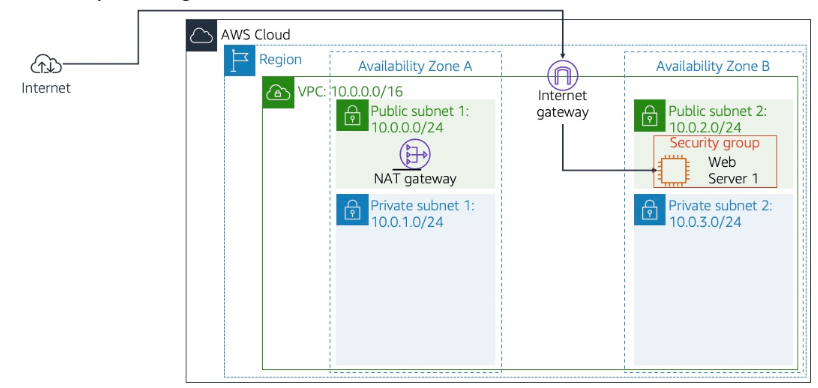
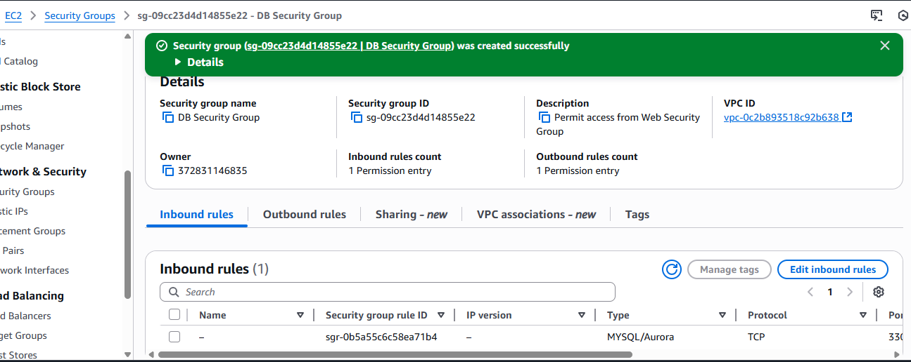
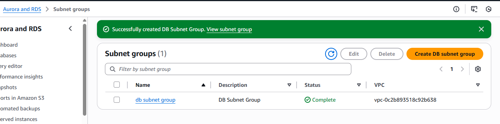
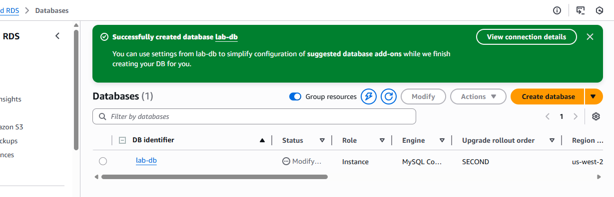
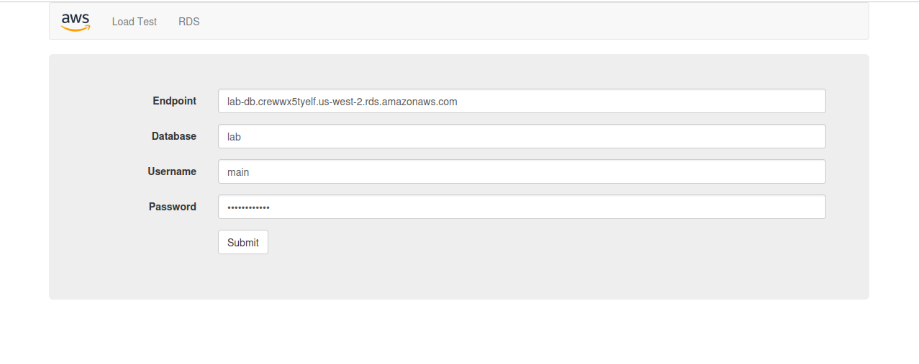
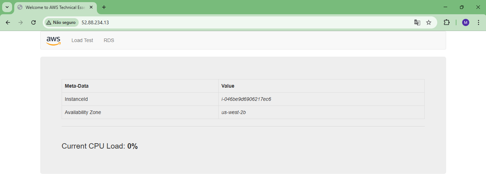
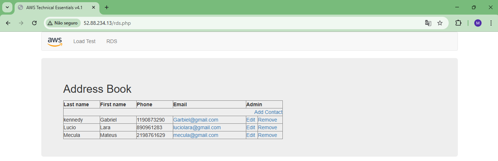
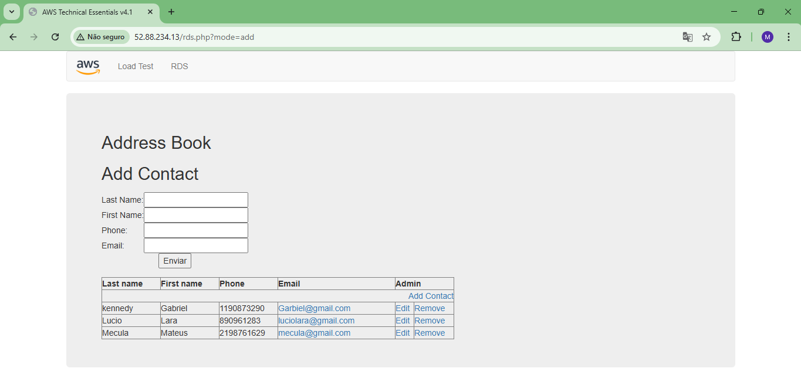
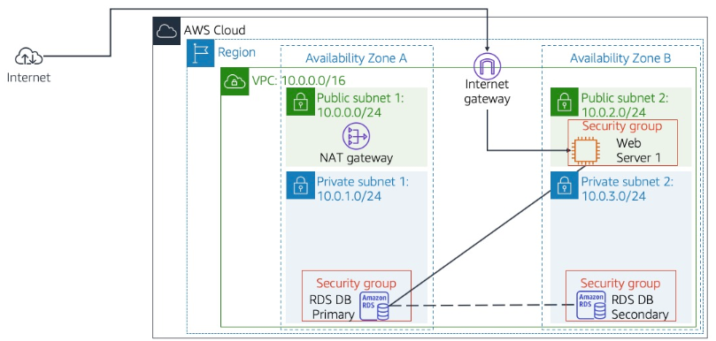

# 🗄️ Amazon RDS – Construção de Servidor de Banco de Dados e Integração com Aplicação Web  

Executei um laboratório prático onde provisionei uma instância **Amazon RDS for MySQL (Multi-AZ)**, configurei a rede e os *security groups*, e integrei o banco com uma aplicação web hospedada em uma instância **EC2**. O objetivo foi validar conectividade, persistência de dados e comportamento Multi-AZ em um ambiente controlado (sandbox).

---

## 🧰 Habilidades adquiridas
- Planejamento e implementação de camadas de rede para bancos de dados (VPC, Subnet Groups).  
- Configuração de **Security Groups** para isolamento e controle de acesso entre camadas.  
- Provisionamento de instâncias **Amazon RDS** com deploy Multi-AZ.  
- Integração de aplicação web (EC2) com RDS via endpoint e credenciais.  
- Testes práticos de persistência, leitura/escrita e validação de replicação Multi-AZ.  
- Boas práticas de governança básica: uso de subnets privadas e princípio do acesso restrito.

---

## 🛠️ Tecnologias utilizadas
- **AWS**: RDS (MySQL), EC2, VPC, Security Groups, DB Subnet Groups.  
- **Banco de Dados**: MySQL 8.0.x (instância RDS).  
- **Servidor de Aplicação**: Instância EC2 rodando o app de exemplo (Address Book Application).  
- **Ferramentas/recursos do laboratório**: console AWS (Management Console) em ambiente sandbox educacional.

---
## 📁 Estrutura do repositório

`conhecendo-RDS-AWS`
```
├── rds-imagem/
└── README.md
```
## 🏗️ Arquitetura

### 🔹 Antes do laboratório

A infraestrutura inicial possuía apenas o servidor web configurado.




## 🖥️ Etapas Realizadas

---

## 🚀 Tarefa 1: Criação do Security Group para a Instância RDS

Iniciei o laboratório criando um *Security Group* específico para o banco de dados.  
Esse grupo foi configurado para permitir tráfego apenas proveniente do **Web Security Group**, garantindo comunicação segura entre o servidor web e a instância RDS.

**Configurações realizadas:**

- **Nome:** DB Security Group  
- **Regra de entrada:**  
  - **Tipo:** MySQL/Aurora - Porta 3306  
  - **Origem:** Web Security Group (instâncias EC2)



📌 Essa etapa garantiu que somente a camada web tivesse permissão para acessar o banco, reforçando o isolamento e a segurança da arquitetura.

---

## 🌐 Tarefa 2: Criação do DB Subnet Group

Depois, configurei um **DB Subnet Group**, especificando quais sub-redes o Amazon RDS poderia utilizar.  
Como a intenção era implantar uma instância Multi-AZ, selecionei duas subnets privadas em zonas de disponibilidade diferentes:

- **10.0.1.0/24** (Private Subnet 1) (privada – AZ A) 
- **10.0.3.0/24** (Private Subnet 2) (privada – AZ B)




📌 Esse conjunto de sub-redes permitiu que o RDS distribuísse sua infraestrutura entre múltiplas AZs, garantindo alta disponibilidade.

---

## 🗄️ Tarefa 3: Criação da Instância Amazon RDS (Multi-AZ – MySQL)

Em seguida, iniciei a criação da instância RDS utilizando o MySQL com implantação Multi-AZ.

### 🔧 Configuração principal:

| Parâmetro       | Valor                                     |
| --------------- | ----------------------------------------- |
| Engine          | MySQL                                     |
| Modelo          | Dev/Test                                  |
| Disponibilidade | Multi-AZ                                  |
| DB Identifier   | **lab-db**                                |
| Master username | **main**                                  |
| Senha           | ************                          |
| Classe          | **db.t3.medium**                          |
| Armazenamento   | SSD – General Purpose                     |
| VPC             | Lab VPC                                   |
| SG              | DB Security Group                         |
| DB Name Inicial | **lab**                                   |
| Backups         | Desativados (para acelerar o laboratório) |



Após o provisionamento, aguardei o status ficar como **Available** e então copiei o **Endpoint** da instância, que seria utilizado na integração com o aplicativo web.

---

## 💻 Tarefa 4: Interação com o Banco de Dados via Aplicação Web

Com o banco pronto, acessei o servidor web pelo seu IP público e abri o aplicativo de exemplo.

Em seguida:

1. Acessei a seção **RDS** do aplicativo.  
2. Preenchi as credenciais e o endpoint do banco:  
   - **Endpoint:** (cópia do RDS)  
   - **Database:** `lab`  
   - **Usuário:** `main`  
   - **Senha:** `lab-password`  
3. Cliquei em **Submit**.




### Após conectar:

- ✔️ O aplicativo executou scripts de criação e importação  
- ✔️ O Address Book ficou disponível  
- ✔️ Testado com cadastros, edições e remoções  




📌 Os dados foram armazenados no RDS e replicados automaticamente para a instância de espera (Multi-AZ).

---

### 🔹 Depois do laboratório

Foi adicionada a instância Multi-AZ do RDS e conectividade segura entre sub-redes privadas e o servidor web.



---

## 🧪 Resultado Final

* RDS Multi-AZ totalmente funcional
* A comunicação EC2 → RDS validada
* Aplicação funcionando sobre uma camada de banco de dados gerenciado
* Conceitos de rede, segurança e alta disponibilidade aplicados

---

⚠️ ***Observação***

Este laboratório foi realizado em um **ambiente sandbox da AWS**, disponibilizado apenas para fins educacionais. Nesse tipo de ambiente, o acesso é temporário e os **recursos são automaticamente encerrados e excluídos ao final da sessão**.

Informações como **Account ID ou nome do usuário do laboratório podem aparecer nos prints**, mas **não representam risco de segurança**, pois não pertencem a uma conta real e não permitem qualquer acesso externo.
